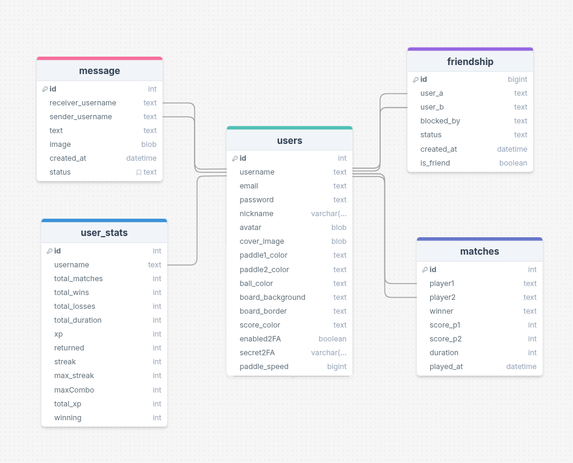

*This project has been created as part of the 42 curriculum by zsailine, mitandri, grasoani, and aranaivo.*

# 🏓 FT_TRANSCENDENCE: BEYOND THE PONG


## 📝 Description

**Ft_transcendence** is part of the final Milestone of the Common Core at 42. The goal is to create a Web Application where every students can showcase their creativity by choosing the content of the Project.

**BEYOND THE PONG** is our project. **BEYOND THE PONG** is a multiplayer game inspired by the famous **Pong Game**.

### Key Features
* **Remote game:** Play with another user in tow different PCs
* **Multiplayer game:** Play with more than two players
* **DM:** Direct messages functionnality where ypu can talk with friends
* **VS AI Game:** Play with a Challenging BOT
* **Local Tournament:** Compete in a tournament locally
* **Leaderboard:** Have an insights of your match history and the achievements you've unlocked
* **Friend System**: Add or remove, block or unblock and search for new friend

---

## 🚀 Instructions

### Prerequisites
* `Docker` & `Docker Compose`
* **Browser:** `Google Chrome (latest stable version)` or `Firefox (latest stable version)` or `Brave (latest stable version)`

### Installation & Run
1.  Clone the repository :
    ```bash
    git clone [link-to-repository] ft_transcendence
    cd ft_transcendence
    ```
2.  Launch the project :
    ```bash
    make
    ```
3.  Access to the project at `https://localhost:9443`


---

## 👥 Team Information

| Member | Role | Responsabilites |
| :--- | :--- | :--- |
| **zsailine** | **Product Owner + Developer** | Has created the idea of BEYOND THE PONG and has validated every functionnality of the game |
| **mitandri** | **Product Manager + Developer** | Has assigned tasks to other members and has checked if all functionnalities are working |
| **aranaivo** | **Tech Lead + Developer** | Has established the project infrastructure on the backend and frontend  |
| **grasoani** | **Architect + Developer** | Has established the project infrastructure in containerization |

---

## 🛠 Project Management
* **Methodology:** Meeting at least once a week to talk about what we have done already at 42 Antananarivo.
* **Task Distribution:** Task distribution via a Trello board.
* **Tools:**
    * **Management:** [GitHub / Trello]
    * **Communication:** [Verbally / Slack]
    * **Version Control:** Git (Feature Branch Workflow).

---

## 💻 Technical Stack

### Architecture
* **Frontend:** `React`, `Typescript`, `Tailwind CSS`
* **Building Tool:** `Vite`
* **Backend:** `Node JS`, `Fastify`
* **Database:** `SQLite` - *Selected for its reliability and ease of use*
* **Real-time:** `Socket.io`
* **DevOps:** `Docker`, `Nginx` (Reverse Proxy), `Vault` (Secrets Management).

### Justification of choice of Building Tools
> *`Vite` was chosen because it is incredibly fast at launching the project and viewing changes in real time, which makes development much smoother than with older tools.*

---

## 🗄 Database Schema



---

## 🕹 Features List

| Features | Team Member(s) | Description |
| :--- | :--- | :--- |
| **Core Game** | zsailine | Algorithm and implementation of the pong game |
| **Docker/Containerization** | grasoani | Deployment of **BEYOND THE PONG** |
| **Live Chat** | mitandri | A real time system of Direct Messges (DM) |
| **User Management** | aranaivo | Creation, connection, update and disconnection of an user |
| **Responsive FRONTEND** | everyone | Application is compatible with different screen size |
| **Real time features** | mitandri, zsailine | Real time updates across all users |
| **Friends system** | mitanddri | Add, unfriend, block, unblock and search for other users |
| **AI opponent** | mitanddri | Implementation of a BOT user |
| **Remote Authentication** | grasoani | Authentication with OAuth 2.0 (Google) |
| **2FA Authentication** | grasoani | A complete Two-Factor Authentication |
| **Dashboard** | zsailine, aranaivo | Insights of user activity |
| **WAF + Vault** | grasoani | Strict security and managing secrets in Vault |
| **Web-based game** | zsailine, aranaivo | BEYOND THE PONG |
| **Remote Players** | zsailine | Two remote users can play the same game |
| **Multiplayer** | zsailine | Three or more players simultaneously |
| **Chat features** | mitandri | More advanced chat features |
| **Game customization** | aranaivo | Customization of the interface of the game |
| **Microservices in Backend** | aranaivo | Make all the services in Backend independent |

---

## 🧩 Modules (Points Calculation)

**Total Points: 30**

| Module | Points | Justification & Implementation | Dev(s) |
| :---  | :--- | :--- | :--- |
| **Real-time features using WebSockets**  | 2 | Used with socket-io on both the frontend and the backend, it was implemented so that the connected user won't need to refresh the pages every time an update was made on the database | mitandri, zsailine |
| **Interaction with other users** | 2 | Used with React and socket-io for the real time update, the module was implemented so that the connected user can interact and communicate with other users | mitandri |
| **Frontend Framework** | 1 | React JS was used on this module to make it easier to build a SPA (Single Page Application) and to be able to use Reusable Components | zsailine, mitandri, grasoani, aranaivo |
| **Backend Framework** | 1 | Node JS and Fastify was used on this module to make it easier to handle more requests per second with lower memory usage, which is ideal for microservices in the Backend | zsailine, mitandri, grasoani, aranaivo |
| **Complete notification system** | 1 | It was implemented so that the user and the developer can see if the update being made was successful or not, and also for better UX (User Experience) | zsailine, mitandri, aranaivo |
| **Reusable Components** | 1 | For easier development so that we don't need to create a new Component for everything | zsailine, mitandri |
| **Support for two additional browsers** | 1 | It was implemented to make **BEYOND THE PONG** accessible and so that all users can have the same experience no matter what browser is used | aranaivo, mitandri |
| **Standard user management and authentication** | 2 | It was implemented to make the user live a real Web Application experience | aranaivo |
| **Game statistics and match history** | 1 | To make the game more realistics and more memorable, since **BEYOND THE PONG** is an experience | zsailine, aranaivo |
| **Remote authentication** | 1 | If a user doesn't want to put a password and an email on the database, they can access the game with Google | grasoani |
| **2FA authentication** | 1 | A choice for the user to make the authentication more secure, and it was implemented for better UX (User Experience) | grasoani |
| **User activity** | 1 | For a better UX, so that the user can track their activity with a nice UI (User Interface) | zsailine |
| **WAF + VAULT** | 2 | To have a more secure and professional project | grasoani |
| **AI Opponent** | 2 | If an user doesn't have an opponent to play with, they can use the AI to make the game a bit more challenging. It was also implemeented to discover the concept of NPCs in a game | mitandri |
| **Complete web-based game** | 2 | It was implemented to make **BEYOND THE PONG** a real game | aranaivo, zsailine |
| **Remote players** | 2 | For better UX, it was implemented so that users don't need to be on the same PC to play the game | zsailine |
| **Multiplayer game** | 2 | It was implemented to give everyone a chance to play **BEYOND THE PONG** | zsailine |
| **Advanced chat features** | 1 | We chose to implement to make the DM features more professional and more on the norm like the famous message application such as Messsenger, Whatsapp | mitandri |
| **Game customization options** | 1 | To make the web Application more lively and more fun to use | aranaivo, zsailine |
| **A gamification system to reward users for their actions** | 1 | It was implemented to make the user more prone to continue playing since achievements are unlocked only if games are player | zsailine |
| **Backend as microservices** | 1 | The goal was to have a well-structured project since the start so it will be easier to write Code, find Files for the developer | aranaivo |

---

## 👨‍💻 Individual Contributions

### | zsailine
* **Contributions:** A Local Tournament
* **Challenges:** Make the tournament online for other users to enter
* **Overcoming:** Thorough documentation on WebSockets, especially socket-io

### | mitandri
* **Contributions:** Implementation of sending Photos on message
* **Challenges:** Send and receiver the photo data via a WebSocket
* **Overcoming:** Learn about what socket-io does to image file when sending or receiving them

### | grasoani
* **Contributions:** Not Use .env file for the variable environment used
* **Challenges:** The way Vault should be initalized
* **Overcoming:** Thorough documentation on the subject

### | aranaivo
* **Contributions:** Make the majority of other member's Pages responsive
* **Challenges:** Understanding the code of other people
* **Overcoming:** Peer-2-Peer by communication as often as possible with other team members.

## 📚 Resources
* [React Icons](https://react-icons.github.io/react-icons/)
* [React Documentation](https://react.dev/learn)
* [Vite Documentation and Installation](https://vite.dev/)
* [Learn React with One Project](https://youtu.be/G6D9cBaLViA?si=92BZmOiXZaChXs0L)
* [Build and Deploy a Real time chat app](https://youtu.be/bR4b_Io8shE?si=fgbB2Az5JodzvRce)
* [Typescript Documentation](https://www.typescriptlang.org/)
* [Web Development Course (Odin Project)](https://www.theodinproject.com/)
* [Tailwind CSS Documentation](https://v2.tailwindcss.com/docs)
* [Learning CSS Flexbox](https://flexboxfroggy.com/)
* [Practice JavaScript](https://leetcode.com/)
* [Socket-io in 90 minutes](https://youtu.be/GdYVTWujYD8?si=TBZZcXUBslb2QaJ_)
* [Node JS Documentation and Installation](https://nodejs.org/en)
* [What is Fastify ? ](https://youtu.be/k1FSybMulVQ)
* [Fastify Documentation](https://fastify.dev/docs/latest/)
* [SQLite Documentation](https://sqlite.org/docs.html)
* [Create a SQLite Database](https://youtu.be/XSZE1iiKdSw?si=zm5sdzlhnZlO2Tbw)
* [Fastify-socket.io](https://github.com/ducktors/fastify-socket.io)
* [Docker Documentation](https://docs.docker.com/)
* [NGINX Documentation](https://nginx.org/en/docs/)
* [Chat GPT](https://chatgpt.com/)
* [Gemini](https://gemini.google.com/)

---
